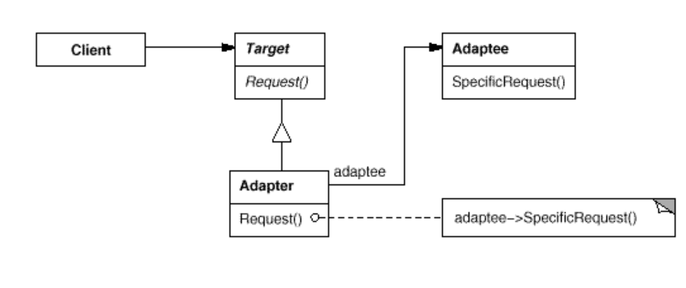

# design-patterns-master-classes

## Programación orientada a objetos
 * Polimorfirsmo: Dos o más objetos son polimórficos respecto a un mensaje, si ambos pueden entenderlos, aun cuando cada uno lo haga de modo diferente

## Patrones de diseño
La idea es reutilizar la experiencia de quienes ya se han encontrado con problemas similares y han encontrado una buena solución.
Los patrones no se inventan, se **descubren**

### Composite
**Estructuras recursivas**
Permite construir objetos de complejidad mayor mediante otros más sencillos de forma recursiva. Los clientes trabajan de igual manera.
Intent
Componer objetos en estructuras de árbol para representarjerarquías parte-todo. El Composite permite que los clientes traten a los objetos atómicos y a sus composiciones uniformemente
Appllicability
Quiere representar jerarquías parte-todo de objetos. Quiere que los objetos “clientes” puedan ignorar las diferencias entre composiciones y objetos individuales. Los clientes trataran a los objetos atómicos y compuestos uniformemente

Participantes
Client: manipula los objetos indistintamente.
Leaf: define el comportamiento de los objetos
primitivos.
Composite: define el comportamiento de objetos
compuestos.
Component: define el protocolo

### Encriptador
**Estructuras recursivas**

### Strategy
**Desacoplar algoritmos**

Objetivo
• Desacoplar un algoritmo del objeto que lo utiliza.
• Permitir cambiar el algoritmo que un objeto utiliza en forma dinámica.
• Brindar flexibilidad para agregar nuevos algoritmos que lleven a cabo una función determinada.

### Adapter

Intención: Convertir la interfaz de una clase en otra que el cliente espera. Adapter permite que ciertas clases trabajen en conjunto cuando no podrían por tener interfaces incompatibles
• Aplicabilidad (Use adapter cuando…) Se quiere usar una clase cuya interfaz no es compatible con lo que precisa

Participantes
• Target (Figure) defines the domain-specific interface that Client uses.
• Client (Editor) collaborates with objects conforming to the Target interface.
• Adaptee (3DFigure) defines an existing interface that needs adapting.
• Adapter (3DAdapter) adapts the interface of Adaptee to the Target interface. 

### Template method
**Algoritmo generico**

Intent:
• Definir el esqueleto de un algoritmo en un metodo, difiriendo algunos pasos a las subclases. El template method permite
que las subclases redefinan ciertos aspectos de un algoritmo sin cambiar su estructura
• Applicabilidad
Para implementar las partes invariantes de un algoritmo una vez y dejas que las sub-clases implementen los aspectos que varian

### Proxy

Intent:
• Define un « representante » de un objeto, de manera de darle al cliente un objeto que se vea y actúe como el cliente espera
• Demorar la construcción de un objeto hasta que sea realmente necesario (virtual proxy).
• Restringir el acceso a un objeto por seguridad (protection proxy).
• Implementación de objetos distribuídos (remote proxy).
• Applicabilidad
• Cuando necesitamos una referencia versatile o mas sofisticada que un punter simmplw

https://refactoring.com/