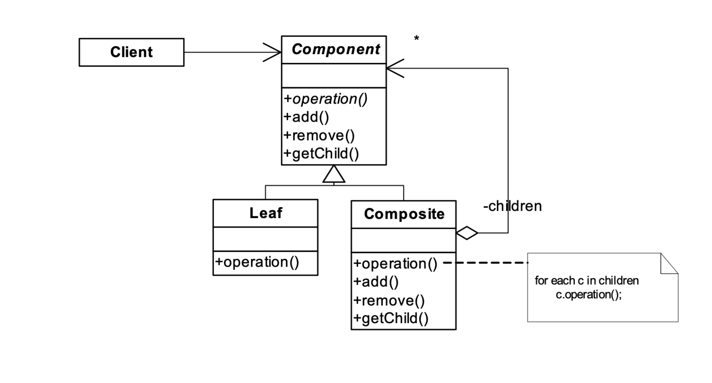

# design-patterns-master-classes

## Programación orientada a objetos
 * Polimorfirsmo: Dos o más objetos son polimórficos respecto a un mensaje, si ambos pueden entenderlos, aun cuando cada uno lo haga de modo diferente

## Patrones de diseño
La idea es reutilizar la experiencia de quienes ya se han encontrado con problemas similares y han encontrado una buena solución.
Los patrones no se inventan, se **descubren**

### Composite
**Estructuras recursivas**
Permite construir objetos de complejidad mayor mediante otros más sencillos de forma recursiva. Los clientes trabajan de igual manera.
Intent
Componer objetos en estructuras de árbol para representarjerarquías parte-todo. El Composite permite que los clientes traten a los objetos atómicos y a sus composiciones uniformemente
Appllicability
Quiere representar jerarquías parte-todo de objetos. Quiere que los objetos “clientes” puedan ignorar las diferencias entre composiciones y objetos individuales. Los clientes trataran a los objetos atómicos y compuestos uniformemente
